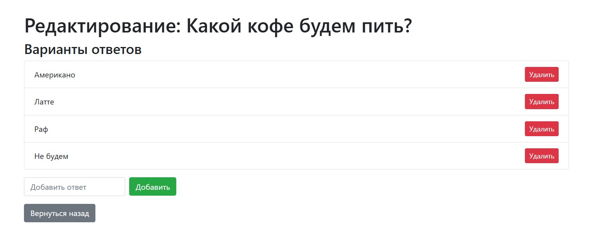

# Опросы Web-приложение

Это веб-приложение позволяет пользователям создавать, редактировать и удалять опросы, а также добавлять и удалять варианты ответов.

## Используемые технологии

1. **Java**
2. **Servlets**
3. **JSP**
4. **Hibernate**
5. **JDBC**
6. **Apache Tomcat**
7. **Bootstrap**
8. **HTML/CSS**
9. **JSTL**

### Используемые библиотеки

- **Hibernate Core**
- **JSTL**
- **PostgreSQL**
- **JDBC Driver**.

## Функцонал

- Создание нового опроса
- Редактирование существующих опросов
- Удаление опросов
- Добавление вариантов ответов к опросам
- Удаление вариантов ответов

# Скриншоты

